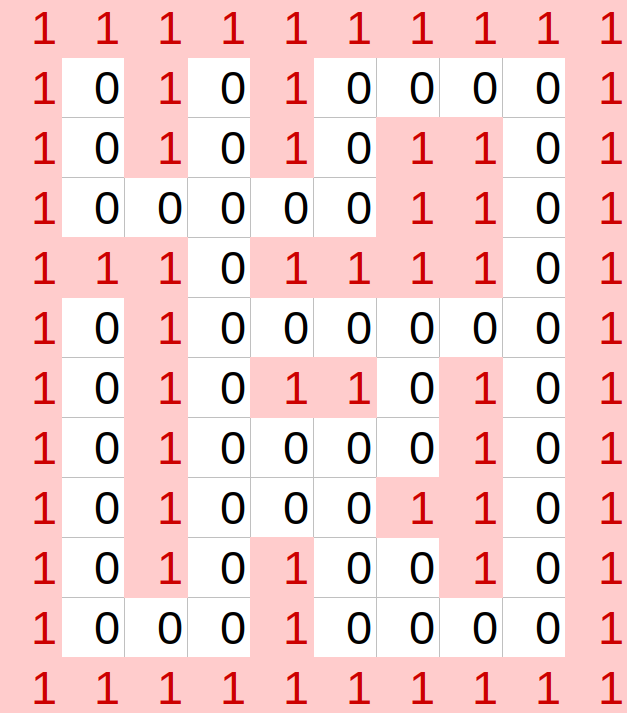

# Entrega Gymnasium
## Tabla de Contenidos
1. [Introducción](#Introduccion)
2. [Q-learning](#q)
3. [SARSA](#S)
4. [A*](#A)
5. [Lanzar el programa](#i4)
## Introducción 
Tal y como se meciona en el guión se genera un laberinto de tamaño 10x12 (Según mi nombre) utilizando la LibreOffice. El mapa es el siguiente:

Se posicion el robot pionner en el inicio (2,2). Por lo que se determina que el punto final se encuentra en la coordenada (11,9) ya que es la esquina opuesta. Notese que en el codigo la posicion es (coordenada-1) ya que en python se cuenta desde 0. Quedando el entorno de Gymnaisum de la siguiente maneraa:  

<pre><code> env_raw = gym.make('gymnasium_csv-v0',
                 render_mode='human',  # "human", "text", None
                 inFileStr='../assets/map2.csv',
                 initX=1,
                 initY=1,
                 goalX=10,
                 goalY=8) </code></pre>

## Q-learning 
### Video 
Video del funcionamiento del controlador
[Enlace](https://youtu.be/v7O99MD4ZUk)

Para asegurar que todo funcione correctamente, probamos el algoritmo después de realizar las modificaciones necesarias para que pudiera resolver el mapa correspondiente (map2.csv). Como parte de estos ajustes, aumentamos las iteraciones a 300.

## SARSA 
### Video
Video del funcionamiento del controlador
[Enlace](https://youtu.be/X8nPELdxMe0)

Se implementa el algoritmo de aprendizaje por refuerzo **SARSA** (State-Action-Reward-State-Action) para entrenar al agente.

### Algoritmo SARSA

SARSA es un método de aprendizaje por refuerzo que actualiza los valores estado-acción basándose en la acción que realmente se tomará en el siguiente estado. Esto lo hace más adecuado para entornos donde las decisiones dependen del comportamiento real del agente.

#### Fórmula de actualización:
$$
Q(s,a) \leftarrow Q(s,a) + \alpha [r + \gamma Q(s',a') - Q(s,a)]
$$

Donde:
- **s**: Estado actual.
- **a**: Acción tomada en **s**.
- **r**: Recompensa obtenida al tomar **a**.
- **s'**: Nuevo estado después de tomar **a**.
- **a'**: Próxima acción seleccionada en **s'**.
- **α (alpha)**: Tasa de aprendizaje (controla la velocidad de actualización).
- **γ (gamma)**: Factor de descuento (pondera recompensas futuras).

### Funcionamiento del Algoritmo

1. **Exploración y explotación**:
   - SARSA utiliza una política *epsilon-greedy* para equilibrar exploración y explotación:
     - Con probabilidad **ε**, el agente toma una acción aleatoria (exploración).
     - Con probabilidad **1-ε**, el agente toma la acción con el mayor valor Q (explotación).

2. **Entrenamiento**:
   - Durante múltiples episodios, el agente aprende a evitar paredes y alcanzar el objetivo optimizando los valores de la tabla Q.

3. **Evaluación**:
   - Una vez entrenado, el agente utiliza la política aprendida para navegar hacia el objetivo tomando las mejores acciones según los valores Q.

### Hiperparámetros Utilizados

Los siguientes hiperparámetros controlan el comportamiento del algoritmo SARSA:

- **Tasa de aprendizaje (`alpha`)**:
  - Define qué tan rápido se actualizan los valores Q.
  - Valor utilizado: `0.5`.

- **Factor de descuento (`gamma`)**:
  - Pondera recompensas futuras frente a recompensas inmediatas.
  - Valor utilizado: `0.95`.

- **Epsilon (`epsilon`)**:
  - Controla la probabilidad de exploración frente a explotación.
  - Valor utilizado: `0.3`.

- **Episodios (`episodes`)**:
  - Número total de episodios durante el entrenamiento.
  - Valor utilizado: `500`.

### Resultados Esperados

1. **Durante el entrenamiento**:
   - El agente explora el mapa tomando acciones aleatorias (exploración epsilon-greedy) y actualiza su política basada en las recompensas obtenidas.
   - Las recompensas totales por episodio deberían mejorar gradualmente conforme el agente aprende a evitar paredes y alcanzar el objetivo.

2. **Durante la evaluación**:
   - El agente navega eficientemente hacia el objetivo utilizando la política aprendida.
  
## A* 
Por ultimo, se realiza un contrlador utilizando la logica A* explicada en la entrega de Webots. Sin emabargo, este caso se utiliza el enviromente de Gymanisum.
### Video 
Video del funcionamiento del controlador
[Enlace](https://youtu.be/_WSvWpLqmOY)

## Lanzar 

